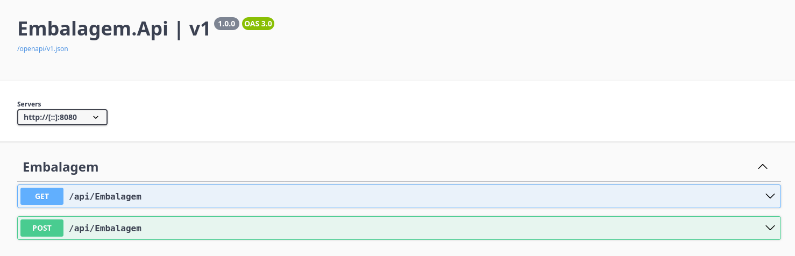

# L2 Embalagem
Sistema de embalagem de produtos criado para um teste técnico da empresa [L2](https://www.l2code.com.br/ "L2").
Ele é composto por um microserviço que embala produtos na menor quantidade de caixas possível, priorizando as de menor tamanho. A persistência de dados é feita com o SQL Server.
Ambos rodam em containers Docker e são executados simultaneamente por meio do Docker Compose.


Para ver a continuação deste projeto, acesse o [branch dev](https://github.com/marvipi-dev/l2-embalagem/tree/dev) do repositório. Ele contém diversas melhorias que não puderam ser implementadas a tempo de entrega, incluindo autenticação e testes unitários.

# Como executar
## Pré-requisitos
- Docker Desktop configurado para usar no mínimo 2GB de RAM;

## Instruções para execução
Assegure que o Docker está rodando, clone o repositório do projeto, entre na pasta raiz do projeto (onde se encontra o arquivo compose.yml), compile e rode com o Docker Compose:
```bash
git clone https://github.com/marvipi-dev/l2-embalagem.git
cd l2-embalagem
docker compose build
docker compose up
```
Com isso, o Docker compilará o API e o subirá dentro de um contêiner e também baixará o banco de dados pré-configurado do Docker Hub ([link](https://hub.docker.com/r/marvipi/embalagem-repository-sqlserver "link")). O Swagger poderá então ser acessado pela URL: http://localhost:5233/swagger.

# API
A API segue o padrão REST e possui dois endpoints: um que embala produtos e outro que exibe os que já foram processados pelo sistema.


# Requisitos para entrega
1. 🗹 Fazer microserviço em .NET Core ou superior utilizando banco de dados SQL Server;
2. 🗹 Tanto o serviço como o banco de dados deve rodar via docker;
3. 🗹 Deve conter REAME.md com os pré-requisitos (provavelmente apenas o docker) e
comandos necessários para rodar a aplicação, recomendado utilizar o “docker-compose”
4. ⮽ A API precisa ter swagger e ser possível testar ela a partir do swagger;
5. 🗹 Enviar o código fonte via link do repositório do github;

# Requisitos opcionais
1. ☐ Segurança na autenticação da API
2. ☐ Deve conter teste unitário


